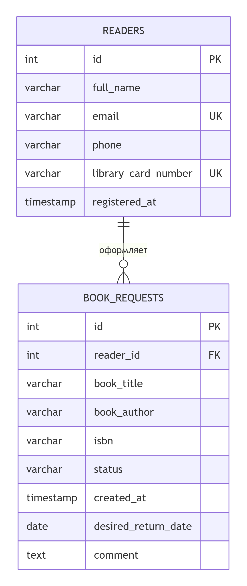

# Библиотечная информационная система

Консольное приложение на Java для учёта читателей библиотеки и заявок на выдачу книг.

**Контрольная работа 1** — разработка консольной информационной системы с использованием JDBC, PostgreSQL и многослойной архитектуры.

---

## Содержание

- [Возможности](#возможности)
- [Архитектура](#архитектура)
- [Технологии](#технологии)
- [Требования](#требования)
- [Установка и запуск](#установка-и-запуск)
- [Структура проекта](#структура-проекта)
- [База данных](#база-данных)
- [Бизнес-правила](#бизнес-правила)
- [Enum RequestStatus](#enum-requeststatus)
- [Функциональность меню](#функциональность-меню)
- [Экспорт в Excel](#экспорт-в-excel)
- [Сборка JAR](#сборка-jar)
- [Частые проблемы](#частые-проблемы)
- [Авторы](#авторы)

---

## Возможности

- Полный CRUD для читателей и заявок на выдачу книг
- 4 способа поиска (по названию книги, автору, ФИО читателя, номеру билета)
- 3 фильтра (по статусу, диапазону дат, читателю)
- 3 сортировки через Stream API (по дате, названию, статусу)
- 12 агрегатных отчётов и 6 показателей статистики
- Экспорт данных в Excel (`.xlsx`) через Apache POI
- Просмотр содержимого таблиц БД прямо из меню
- 11 бизнес-правил, реализованных в сервисном слое
- Обработка ошибок без аварийного завершения программы

---

## Архитектура

Проект построен по многослойной схеме:

Console UI → Service → Repository / JDBC → PostgreSQL

| Слой       | Назначение                | Пакет                       |
| ---------- | ------------------------- | --------------------------- |
| Console UI | Меню, ввод, вывод         | ru.mirea.library.ui         |
| Service    | Бизнес-логика, валидация  | ru.mirea.library.service    |
| Repository | SQL-запросы, JDBC         | ru.mirea.library.repository |
| Model      | Предметные сущности       | ru.mirea.library.model      |
| Exception  | Собственные исключения    | ru.mirea.library.exception  |
| Util       | Подключение к БД, экспорт | ru.mirea.library.util       |

SQL-запросы находятся только в слое Repository. В UI нет ни одной строки SQL.

---

## Технологии

- Java 17
- Maven 3.9+
- PostgreSQL 13+
- JDBC (org.postgresql:postgresql)
- Apache POI (poi-ooxml) — экспорт в Excel
- JUnit 5 — модульное тестирование

---

## Требования

- JDK 17 или выше
- Maven 3.9 или выше
- PostgreSQL 13 или выше
- Доступ к базе данных от пользователя postgres (или другого с правами на создание таблиц)

Проверить версии:

java -version
mvn -version
psql --version

---

## Установка и запуск

### 1. Клонировать репозиторий

git clone https://github.com/Sofiia-cloud/library-pks.git
cd library-pks

### 2. Создать базу данных

createdb -U postgres library_db

Спросит пароль пользователя postgres.

### 3. Применить схему и тестовые данные

chcp 65001
set PGCLIENTENCODING=UTF8
psql -U postgres -d library_db -f schema.sql

chcp 65001 и PGCLIENTENCODING=UTF8 обязательны, иначе русские буквы в тестовых данных не загрузятся.

Ожидаемый результат:

DROP TABLE
DROP TABLE
CREATE TABLE
CREATE TABLE
CREATE INDEX
CREATE INDEX
INSERT 0 5
INSERT 0 12

### 4. Настроить подключение

copy src\main\resources\db.properties.example src\main\resources\db.properties
notepad src\main\resources\db.properties

Вписать свой пароль PostgreSQL:

db.url=jdbc:postgresql://localhost:5432/library*db
db.user=postgres
db.password=ТВОЙ*ПАРОЛЬ

Файл db.properties добавлен в .gitignore и не коммитится.

### 5. Собрать проект

mvn clean package -DskipTests

Первый запуск скачает зависимости (1–3 минуты). Итог:

[INFO] BUILD SUCCESS

### 6. Запустить приложение

chcp 65001
java -Dfile.encoding=UTF-8 -jar target\library-system-1.0-SNAPSHOT.jar

Появится главное меню.

### 7. Альтернативный запуск через Maven

chcp 65001
mvn exec:java "-Dexec.mainClass=ru.mirea.library.Main"

В PowerShell и cmd возможны проблемы с кириллицей. Рекомендуется запуск через JAR (шаг 6).

---

## Структура проекта

```
library-pks/
├── pom.xml
├── schema.sql
├── README.md
├── mermaid.png
├── .gitignore
└── src/
    └── main/
        ├── java/ru/mirea/library/
        │   ├── Main.java
        │   │
        │   ├── model/
        │   │   ├── Reader.java
        │   │   ├── BookRequest.java
        │   │   └── RequestStatus.java
        │   │
        │   ├── repository/
        │   │   ├── Repository.java
        │   │   ├── ReaderRepository.java
        │   │   ├── BookRequestRepository.java
        │   │   └── ReportRepository.java
        │   │
        │   ├── service/
        │   │   ├── ReaderService.java
        │   │   ├── BookRequestService.java
        │   │   ├── SearchService.java
        │   │   ├── FilterService.java
        │   │   ├── SortService.java
        │   │   ├── StatisticService.java
        │   │   └── ReportService.java
        │   │
        │   ├── exception/
        │   │   ├── BusinessException.java
        │   │   ├── DatabaseException.java
        │   │   └── EntityNotFoundException.java
        │   │
        │   ├── ui/
        │   │   ├── ConsoleMenu.java
        │   │   ├── InputHelper.java
        │   │   ├── ReaderMenu.java
        │   │   ├── BookRequestMenu.java
        │   │   ├── SearchMenu.java
        │   │   ├── FilterMenu.java
        │   │   ├── SortMenu.java
        │   │   ├── ReportMenu.java
        │   │   ├── StatisticMenu.java
        │   │   └── DatabaseViewMenu.java
        │   │
        │   └── util/
        │       ├── DatabaseManager.java
        │       └── ExcelExporter.java
        │
        └── resources/
            ├── db.properties.example
            └── db.properties          ← не коммитится (в .gitignore)
```

---

## База данных

### ER-диаграмма



### Схема

readers — читатели библиотеки:

| Колонка             | Тип          | Ограничения             |
| ------------------- | ------------ | ----------------------- |
| id                  | SERIAL       | PRIMARY KEY             |
| full_name           | VARCHAR(150) | NOT NULL                |
| email               | VARCHAR(150) | NOT NULL, UNIQUE        |
| phone               | VARCHAR(30)  |                         |
| library_card_number | VARCHAR(30)  | NOT NULL, UNIQUE        |
| registered_at       | TIMESTAMP    | NOT NULL, DEFAULT NOW() |

book_requests — заявки на выдачу книги:

| Колонка             | Тип          | Ограничения                                                           |
| ------------------- | ------------ | --------------------------------------------------------------------- |
| id                  | SERIAL       | PRIMARY KEY                                                           |
| reader_id           | INTEGER      | NOT NULL, FOREIGN KEY → readers(id) ON DELETE RESTRICT                |
| book_title          | VARCHAR(200) | NOT NULL                                                              |
| book_author         | VARCHAR(150) | NOT NULL                                                              |
| isbn                | VARCHAR(20)  |                                                                       |
| status              | VARCHAR(20)  | NOT NULL, CHECK (CREATED/APPROVED/ISSUED/RETURNED/CANCELLED/REJECTED) |
| created_at          | TIMESTAMP    | NOT NULL, DEFAULT NOW()                                               |
| desired_return_date | DATE         |                                                                       |
| comment             | TEXT         |                                                                       |

### Связь

book_requests.reader_id → readers.id — many-to-one, ON DELETE RESTRICT (нельзя удалить читателя, у которого есть заявки).

### Тестовые данные

- 5 читателей
- 12 заявок
- 6 различных статусов (CREATED, APPROVED, ISSUED, RETURNED, CANCELLED, REJECTED)

---

## Бизнес-правила

Правила реализованы в сервисном слое, а не в интерфейсе.

| #   | Правило                                      | Где реализовано                                   |
| --- | -------------------------------------------- | ------------------------------------------------- |
| 1   | ФИО читателя обязательно                     | ReaderService.create                              |
| 2   | Email по regex, обязателен, уникален         | ReaderService.validateEmail                       |
| 3   | Номер билета LIB-XXXX, обязателен, уникален  | ReaderService.validateCard                        |
| 4   | Телефон по regex (если указан)               | ReaderService.validatePhone                       |
| 5   | Нельзя удалить читателя с активными заявками | ReaderService.delete                              |
| 6   | Название книги обязательно                   | BookRequestService.create                         |
| 7   | Автор книги обязателен                       | BookRequestService.create                         |
| 8   | Читатель должен существовать                 | BookRequestService через ReaderService.existsById |
| 9   | Дата возврата не в прошлом                   | BookRequestService.create                         |
| 10  | Запрещены недопустимые переходы статусов     | RequestStatus.canTransitionTo                     |
| 11  | Нельзя удалить заявку в статусе ISSUED       | BookRequestService.delete                         |

---

## Enum RequestStatus

public enum RequestStatus {
CREATED, // создана
APPROVED, // одобрена
ISSUED, // выдана
RETURNED, // возвращена
CANCELLED, // отменена
REJECTED // отклонена
}

Разрешённые переходы (метод canTransitionTo):

| Из                            | В                             |
| ----------------------------- | ----------------------------- |
| CREATED                       | APPROVED, CANCELLED, REJECTED |
| APPROVED                      | ISSUED, CANCELLED             |
| ISSUED                        | RETURNED                      |
| RETURNED, CANCELLED, REJECTED | — (терминальные)              |

---

## Функциональность меню

Главное меню:

1. Читатели
2. Заявки на выдачу книги
3. Поиск
4. Фильтрация
5. Сортировка
6. Отчёты и статистика
7. Экспорт данных (Excel)
8. Показать таблицы БД
9. Выход

### 1. Читатели

- Создание, список, поиск по ID, изменение, удаление
- Валидация: ФИО, email, телефон, номер билета
- Запрет удаления при активных заявках

### 2. Заявки на выдачу книги

- Создание, список, поиск по ID, изменение, удаление
- Смена статуса с проверкой допустимых переходов

### 3. Поиск

1. По названию книги (ILIKE)
2. По автору (ILIKE)
3. По ФИО читателя (JOIN + ILIKE)
4. По номеру читательского билета

### 4. Фильтрация

1. По статусу
2. По диапазону дат создания
3. По читателю

### 5. Сортировка (Stream API)

1. По дате создания (↑ / ↓)
2. По названию книги (А-Я / Я-А)
3. По статусу (↑ / ↓)

### 6. Отчёты и статистика

12 агрегатов (все — SQL GROUP BY / JOIN / LEFT JOIN / LIMIT):

1. Сводка (всего / активных / просроченных / среднее)
2. Распределение по статусам с процентами
3. Топ книг по числу заявок
4. Топ авторов по числу заявок
5. Топ читателей по активности
6. Активность всех читателей (включая нули)
7. Читатели без заявок
8. Заявки по месяцам за год

6 показателей в краткой статистике:

- Всего читателей
- Всего заявок
- Активных (CREATED + APPROVED + ISSUED)
- Возвращённых
- Отменённых/отклонённых
- Заявок за последние 30 дней

### 7. Экспорт данных

Экспорт в library_requests.xlsx через Apache POI.

### 8. Показать таблицы БД

Прямой SELECT \* из readers и book_requests.

---

## Экспорт в Excel

Файл library_requests.xlsx создаётся в корне проекта.

Колонки:

| ID заявки | ФИО читателя | Название книги | Автор | ISBN | Статус | Создана | Вернуть до | Комментарий |
| --------- | ------------ | -------------- | ----- | ---- | ------ | ------- | ---------- | ----------- |

Данные берутся из SQL-запроса с JOIN book_requests + readers.

Оформление: тёмный заголовок, бежевый фон тела, автоширина колонок, формат дат dd.MM.yyyy HH:mm.

---

## Сборка JAR

mvn clean package -DskipTests

Создаётся target/library-system-1.0-SNAPSHOT.jar со всеми зависимостями (maven-shade-plugin).

Запуск:

java -Dfile.encoding=UTF-8 -jar target\library-system-1.0-SNAPSHOT.jar

---

## Частые проблемы

### psql не распознаётся

Добавь bin PostgreSQL в PATH:

set PATH=C:\Program Files\PostgreSQL\13\bin;%PATH%

Для постоянного эффекта — «Изменение переменных среды текущего пользователя» → Path → добавить C:\Program Files\PostgreSQL\13\bin.

### Кириллица в psql

chcp 65001
set PGCLIENTENCODING=UTF8

### Ошибка при psql -f schema.sql: «для символа ... нет эквивалента в UTF8»

То же решение — PGCLIENTENCODING=UTF8. Если не помогает — пересохрани schema.sql в кодировке UTF-8 (VS Code → Save with Encoding → UTF-8).

### mvn не распознаётся

Maven не в PATH. Добавь C:\tools\apache-maven-3.9.9\bin в переменную Path.

### db.properties не найден в classpath

copy src\main\resources\db.properties.example src\main\resources\db.properties

и впиши пароль.

### password authentication failed for user "postgres"

Неверный пароль в db.properties. Проверь, что это тот же пароль, что вводил в psql.

### В PowerShell java -Dfile.encoding=UTF-8 -jar ... — ошибка ClassNotFoundException: /encoding=UTF-8

PowerShell разбивает аргумент. Используй:

java "-Dfile.encoding=UTF-8" -jar target\library-system-1.0-SNAPSHOT.jar

или запускай через cmd.exe.

### В PowerShell кириллица «крякозябрится»

Используй cmd.exe:

cmd
chcp 65001
java -Dfile.encoding=UTF-8 -jar target\library-system-1.0-SNAPSHOT.jar

### ERROR StatusLogger Log4j2 could not find a logging implementation

Безобидное предупреждение Apache POI. Игнорируй.

### Excel-файл создаётся, но не открывается / пустой

Убедись, что он не открыт в другой программе. Закрой Excel и повтори экспорт.

---

## Авторы

Команда из 4 человек, группа ЭФБО-02-24, РТУ МИРЭА

- Участник 1 (Семенов Тихон): инфраструктура, БД, сущность Reader
- Участник 2 (Иванова Валерия): сущность BookRequest, enum RequestStatus, бизнес-правила
- Участник 3 (Головушкина София): поиск, фильтрация, сортировка, статистика, отчёты
- Участник 4 (Лукьянов Антон): главное меню, экспорт в Excel, README
